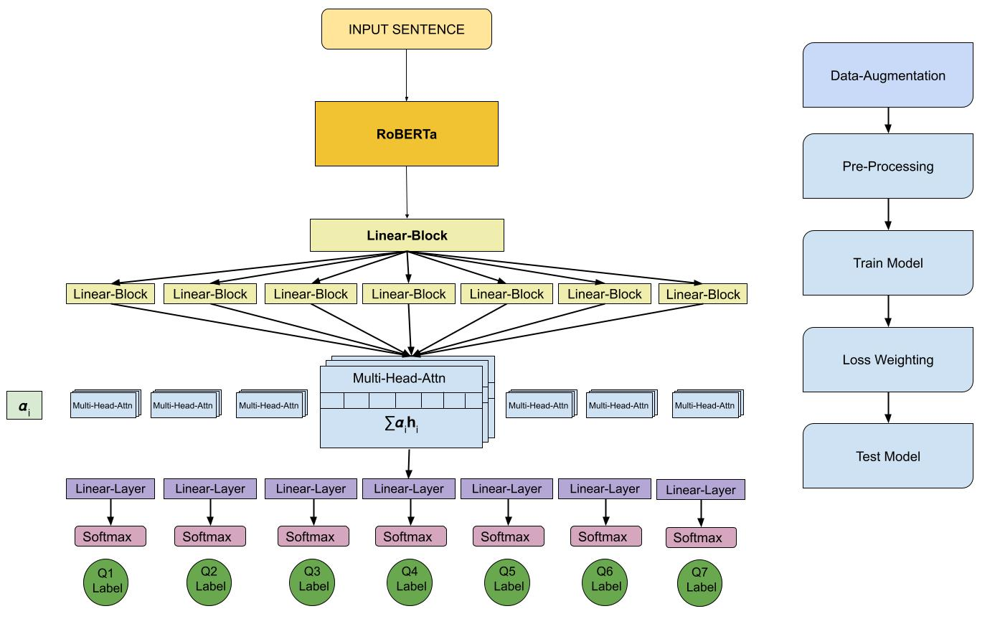

# NLP4IF

Code for the paper <b>Multi Output Learning using Task Wise Attention for Predicting BinaryProperties of Tweets</b> on the <a href="https://gitlab.com/NLP4IF/nlp4if-2021">Shared-Task-On-Fighting the COVID-19 Infodemic, NLP4IF workshop</a>, NAACL'21.

This is the code bagging <b>runners-up</b> position on the English subtask of the competition.

### Overview

<b>Multi-Head Task-Wise Attention</b>



### Instructions to train

The codebase uses <a href="wandb.ai">wandb</a> for visualizations and progress tracking.

Install `wandb` as :

```
pip install wandb
wandb login
```

Now go over to the link in the terminal and paste your API key.

<b>Note : </b> Before training make sure to add your `wandb` credentials as :

```
wandb.init(name=args.wandb_run, project='project_name', entity='entity_name')
```

in the files `bert_train.py` and `roberta_train.py` (line 68 in each file).

```
git clone https://github.com/shreyas-kowshik/nlp4if.git
cd nlp4if
bash setup.sh

python roberta_train.py -bs 32 -lr 5e-5 -lr_emb 5e-6 -e 120 -wdbr [wandb_run_name] -model roberta_attn_classwise --base roberta-base --save_model True -dtp data/english/v3/v3_augmented/covid19_disinfo_binary_english_train.tsv -ddp data/english/v3/v3/covid19_disinfo_binary_english_dev_input.tsv
```
